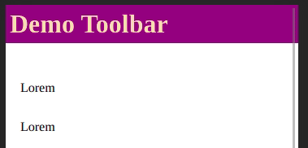

# AutoHideToolbar


Angular auto hiding header component (Ivy compatible, optimized, minimal (less than 3kb), zero dependencies).



## Install

To install this lib in your angular project

```bash
ng add auto-hide-toolbar
```

## Usage

`your.module.ts`
```ts
import { AutoHideToolbarModule } from 'auto-hide-toolbar';
// ...
@NgModule({
  ...
  imports: [..., AutoHideToolbarModule],
})
export class YourModule {}
```

`your.component.html`
```html
<!-- page top -->
<lib-auto-hide-toolbar shadowPadding="9">
  <!-- your toolbar html goes here -->
</lib-auto-hide-toolbar>
```

### Example
```html
<lib-auto-hide-toolbar shadowPadding="9">
  <div style="background-color: purple; padding: 5px;">
    <h1 style="margin: 0px; color: wheat;">Demo Toolbar</h1>
  </div>
</lib-auto-hide-toolbar>
```

### Attribute `shadowPadding`
Adds basic padding below the falling header component - to preserve shadows if any. Unit in pixels.
</br>
</br>
[Project scaffolded with Angular 10.0.9]

## Licence
MIT &copy; 2020 [Vajahath Ahmed](https://twitter.com/vajahath7)